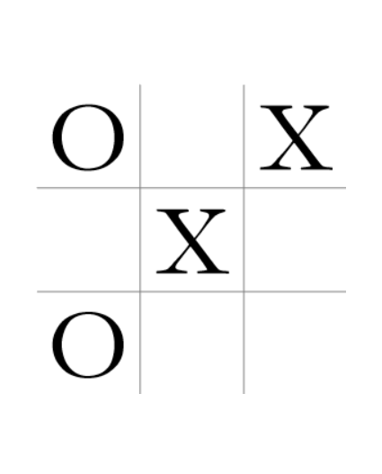

# Tic-Tac-Toe

This is an implementation of Tic-tac-toe using the [Negamax](http://wikipedia.org/en/Negamax) algorithm and React, for the [FreeCodeCamp](http://freecodecamp.org) front-end development certificate. 

<!-- The project is described here - https://www.freecodecamp.com/challenges/build-a-tic-tac-toe-game. -->

To play the game, click [here](http://bburns.github.io/Tic-Tac-Toe/).

